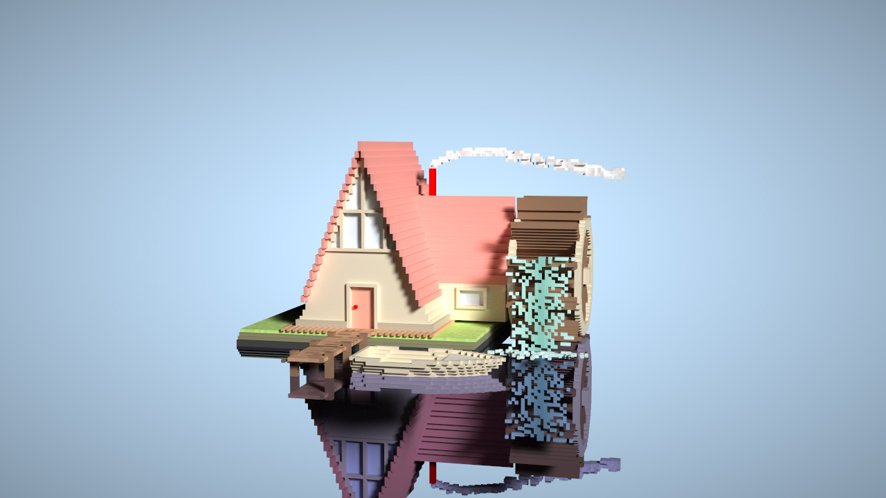
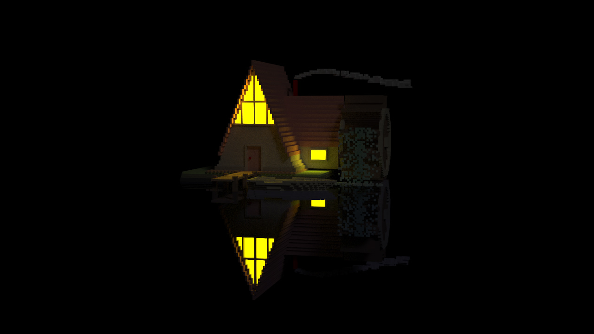

# <a name="title">Taichi Voxel Challenge</a>

## Riverside Cabin

<p align="center">
</img>
</img>
</p>

## Installation

Make sure your `pip` is up-to-date:

```bash
pip3 install pip --upgrade
```

Assume you have a Python 3 environment, simply run:

```bash
pip3 install -r requirements.txt
```

to install the dependencies of the voxel renderer.

## Quickstart

```sh
python3 riverside-cabin.py
```

Mouse and keyboard interface:

+ Drag with your left mouse button to rotate the camera.
+ Press `W/A/S/D/Q/E` to move the camera.
+ Press `P` to save a screenshot.
